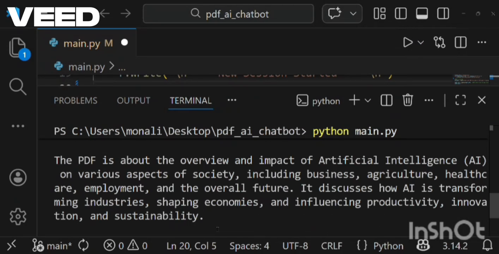

# Python PDF AI Assistant

This project is a Python-based command-line tool that allows users to interact with PDF documents using AI.  
It works with both normal text-based PDFs and scanned PDFs by automatically applying OCR when required.

I built this project to better understand how real-world documents are processed and how AI can be used to extract useful information from them.
--------

## What this project does

- Reads text from normal PDFs
- Detects scanned PDFs and applies OCR automatically
- Allows users to ask questions based on PDF content
- Generates AI-based answers from the document
- Summarizes PDFs into key points
- Runs completely in the terminal
- Saves asked questions and AI-generated answers for reference
--------

## Why I built this

While learning Python, I noticed that many real documents are scanned PDFs, not clean text files.  
Most basic PDF tools fail to handle such cases properly.

This project helped me:
- Work with real-world PDFs
- Learn OCR integration
- Understand AI-based text processing
- Build a complete, working application instead of isolated scripts
--------

## How it works (high level)

1. The user provides a PDF file
2. The program checks whether readable text exists
3. If no text is found, OCR is applied automatically
4. Extracted text is sent to an AI model
5. The user can interact using a menu to:
   - Ask questions
   - Generate summaries
   - View results directly in the terminal
--------

## Project structure

- `main.py` – Entry point of the application
- `pdf_reader.py` – Handles PDF text extraction
- `ocr_utils.py` – Applies OCR for scanned PDFs
--------

## Technologies used

- Python
- PyPDF2
- Tesseract OCR
- pdf2image
- Pillow
- AI API integration

--------

## How to run the project

1. Clone the repository
2. Install required Python packages
3. Make sure Tesseract OCR is installed on your system
4. Run the main Python file
5. Provide a PDF file when prompted
6. Choose actions from the menu

--------
## Example usage

- Upload a scanned PDF document  
- Ask a question like: *"What is this document about?"*  
- Receive an AI-generated answer based on the PDF content
- Questions and answers are stored so users can review them later  
--------
## What I learned from this project

- Handling different types of PDFs
- Working with OCR and image-based documents
- Structuring Python projects clearly
- Integrating AI into practical applications
- Building end-to-end functional tools
 ---------

## Future improvements
- Add a simple user interface
- Improve OCR accuracy for complex layouts
- Support more document forma

This project represents my learning journey in Python and my growing interest in AI-based applications.
